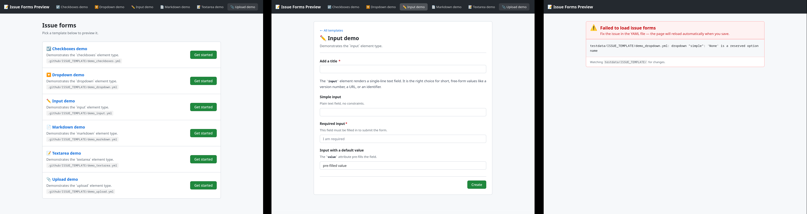

<div align="center">
  
  <p>A tool to preview and validate GitHub forms (issues and discussions).</p>
</div>

## Why?

I created this tool because I was tired of having to commit and push my forms to GitHub to see if they would work.

<p align="center">
    
</p>

## Description

It applies a JSON schema validation and also the "post" rules from GitHub that you can only find by committing and pushing the form.

It also warns about some common mistakes (ex: dropdowns with `required` but without `multiple`).

The pages are live reloaded every time you change a form file, and the errors are immediately displayed.

The style of the form pages is close to GitHub, but not exactly the same.

## Installation

```bash
go install github.com/ldez/ghforms@latest
```

or download the binary from the [releases](https://github.com/ldez/ghforms/releases) page.

## Usage

### Live Preview and Validation

```bash
ghforms [-addr :8080] [-dir .github/ISSUE_TEMPLATE]
```

| Flag    | Default                  | Description                 |
|---------|--------------------------|-----------------------------|
| `-addr` | `:8080`                  | HTTP listen address         |
| `-dir`  | `.github/ISSUE_TEMPLATE` | Directory to scan for forms |

#### Examples

By default, it looks for the forms inside the `.github/ISSUE_TEMPLATE` directory (non-recursive).

```bash
ghforms
```

If you want to use a different directory:

```bash
ghforms -dir .github/DISCUSSION_TEMPLATE
```

If you want to use a different port:

```bash
ghforms -addr ':8686'
```

### Only Validate the Forms

```bash
ghforms verify [-dir .github]
```

| Flag   | Default    | Description                             |
|--------|------------|-----------------------------------------|
| `-dir` | `.github/` | Directory to scan for forms (recursive) |

#### Examples

By default, it looks for the forms inside the `.github` directory (recursive).

```bash
ghforms verify
```

## References

- [syntax-for-issue-forms](https://docs.github.com/en/communities/using-templates-to-encourage-useful-issues-and-pull-requests/syntax-for-issue-forms)
- [syntax-for-githubs-form-schema](https://docs.github.com/en/communities/using-templates-to-encourage-useful-issues-and-pull-requests/syntax-for-githubs-form-schema)
- [common-validation-errors-when-creating-issue-forms](https://docs.github.com/en/communities/using-templates-to-encourage-useful-issues-and-pull-requests/common-validation-errors-when-creating-issue-forms)
- [creating-discussion-category-forms](https://docs.github.com/en/discussions/managing-discussions-for-your-community/creating-discussion-category-forms)
- [syntax-for-discussion-category-forms](https://docs.github.com/en/discussions/managing-discussions-for-your-community/syntax-for-discussion-category-forms)
